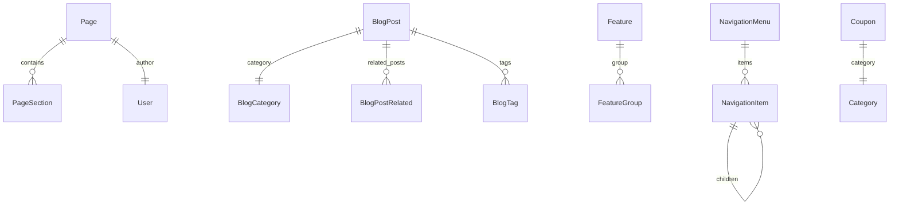

# Dynamic Content Management Schema Design

## Overview
This document outlines the comprehensive database schema and API structure for managing dynamic content on the BachatList website.

## Prisma Schema Extensions

```prisma
// =====================================================
// DYNAMIC PAGES MANAGEMENT
// =====================================================

// Dynamic Pages - For managing /loot, /features, /about, /telegram, /coupon pages
model Page {
  id              String      @id @default(cuid())
  title           String
  slug            String      @unique
  excerpt         String?     @db.Text // Short description for cards/previews
  content         String?     @db.LongText // Main content (HTML or Markdown)
  
  // SEO Fields
  metaTitle       String?
  metaDescription String?     @db.Text
  metaKeywords    String?     @db.Text
  ogImage         String?     // Open Graph image URL
  
  // Media
  featuredImage   String?
  
  // Status & Publishing
  status          PageStatus  @default(DRAFT)
  publishedAt     DateTime?
  
  // Ordering
  order           Int         @default(0)
  
  // Template Selection
  template        PageTemplate @default(DEFAULT)
  
  // Relationships
  authorId        String?
  author          User?       @relation(fields: [authorId], references: [id])
  
  // Sections for page builder
  sections        PageSection[]
  
  timestamps
  createdAt       DateTime    @default(now())
  updatedAt       DateTime    @updatedAt
  
  @@index([slug])
  @@index([status])
  @@map("pages")
}

enum PageStatus {
  DRAFT
  PUBLISHED
  ARCHIVED
}

enum PageTemplate {
  DEFAULT
  LANDING
  BLOG_LIST
  BLOG_POST
  FEATURES
  ABOUT
  CONTACT
  LOOT_DEALS
  COUPON
  TELEGRAM
}

// Page Sections - For page builder functionality
model PageSection {
  id              String        @id @default(cuid())
  pageId          String
  page            Page          @relation(fields: [pageId], references: [id], onDelete: Cascade)
  
  sectionType     SectionType
  title           String?
  content         String?       @db.LongText
  data            String?       @db.Text // JSON for dynamic data
  
  // Styling
  backgroundColor String?
  textColor       String?
  padding         String?       // CSS padding value
  
  // Ordering
  order           Int           @default(0)
  
  // Visibility
  isActive        Boolean       @default(true)
  
  timestamps
  createdAt       DateTime      @default(now())
  updatedAt       DateTime      @updatedAt
  
  @@index([pageId])
  @@map("page_sections")
}

enum SectionType {
  HERO
  FEATURES_GRID
  TESTIMONIALS
  CTA
  CONTENT_BLOCK
  IMAGE_GALLERY
  FAQ
  PRICING
  TEAM
  STATS
  CUSTOM_HTML
  BLOG_POSTS
  DEALS_GRID
  COUPONS_GRID
  TELEGRAM_JOIN
  CONTACT_FORM
}

// =====================================================
// BLOG MANAGEMENT
// =====================================================

model BlogCategory {
  id          String      @id @default(cuid())
  name        String
  slug        String      @unique
  description String?     @db.Text
  image       String?
  
  // Ordering
  order       Int         @default(0)
  isActive    Boolean     @default(true)
  
  // SEO
  metaTitle   String?
  metaDescription String? @db.Text
  
  // Relationships
  posts       BlogPost[]
  
  timestamps
  createdAt   DateTime    @default(now())
  updatedAt   DateTime    @updatedAt
  
  @@index([slug])
  @@map("blog_categories")
}

model BlogPost {
  id              String          @id @default(cuid())
  title           String
  slug            String          @unique
  excerpt         String?         @db.Text // For cards and meta
  content         String          @db.LongText // Full article content
  
  // Media
  featuredImage   String?
  images          String?         @db.Text // JSON array of additional images
  
  // Categorization
  categoryId      String?
  category        BlogCategory?   @relation(fields: [categoryId], references: [id])
  tags            String?         @db.Text // JSON array of tags
  
  // Author Info
  authorName      String?         // For guest authors
  authorImage     String?
  
  // Reading Time
  readTime        Int?            // Estimated minutes
  
  // SEO
  metaTitle       String?
  metaDescription String?         @db.Text
  metaKeywords    String?         @db.Text
  ogImage         String?
  
  // Status
  status          BlogStatus      @default(DRAFT)
  isFeatured      Boolean         @default(false)
  isSticky        Boolean         @default(false) // Sticky post at top
  
  // Publishing
  publishedAt     DateTime?
  scheduledAt     DateTime?
  
  // Tracking
  views           Int             @default(0)
  
  // Relationships
  authorId        String?
  author          User?           @relation(fields: [authorId], references: [id])
  
  // Related Posts
  relatedPosts    BlogPostRelated[] @relation("RelatedPost")
  relatedTo       BlogPostRelated[] @relation("MainPost")
  
  timestamps
  createdAt       DateTime        @default(now())
  updatedAt       DateTime        @updatedAt
  
  @@index([slug])
  @@index([status])
  @@index([categoryId])
  @@index([publishedAt])
  @@map("blog_posts")
}

model BlogPostRelated {
  id              String    @id @default(cuid())
  mainPostId      String
  mainPost        BlogPost  @relation("MainPost", fields: [mainPostId], references: [id], onDelete: Cascade)
  relatedPostId   String
  relatedPost     BlogPost  @relation("RelatedPost", fields: [relatedPostId], references: [id], onDelete: Cascade)
  order           Int       @default(0)
  
  @@unique([mainPostId, relatedPostId])
  @@map("blog_post_related")
}

enum BlogStatus {
  DRAFT
  PUBLISHED
  ARCHIVED
}

// =====================================================
// FEATURES MANAGEMENT
// =====================================================

model Feature {
  id              String    @id @default(cuid())
  title           String
  description     String    @db.Text
  
  // Icon/Media
  icon            String?   // Icon name or emoji
  image           String?
  
  // Link
  linkUrl         String?
  linkText        String?
  
  // Ordering & Visibility
  order           Int       @default(0)
  isActive        Boolean   @default(true)
  isFeatured      Boolean   @default(false)
  
  // Styling
  color           String?   // Brand color for this feature
  backgroundColor String?
  
  // Relationships
  featureGroupId  String?
  featureGroup    FeatureGroup? @relation(fields: [featureGroupId], references: [id])
  
  timestamps
  createdAt       DateTime  @default(now())
  updatedAt       DateTime  @updatedAt
  
  @@index([order])
  @@index([isActive])
  @@map("features")
}

model FeatureGroup {
  id              String    @id @default(cuid())
  title           String
  description     String?   @db.Text
  
  // Ordering
  order           Int       @default(0)
  isActive        Boolean   @default(true)
  
  // Styling
  layout          FeatureLayout @default(GRID)
  
  features        Feature[]
  
  timestamps
  createdAt       DateTime  @default(now())
  updatedAt       DateTime  @updatedAt
  
  @@map("feature_groups")
}

enum FeatureLayout {
  GRID
  LIST
  CARDS
  ICONS
  HORIZONTAL_SCROLL
}

// =====================================================
// ABOUT PAGE SECTIONS
// =====================================================

model AboutSection {
  id              String        @id @default(cuid())
  sectionKey      String        @unique // "our_story", "mission", "contact_info", etc.
  title           String
  content         String?       @db.LongText
  
  // Media
  image           String?
  imagePosition   ImagePosition @default(RIGHT)
  
  // Ordering
  order           Int           @default(0)
  isActive        Boolean       @default(true)
  
  // SEO
  metaTitle       String?
  metaDescription String?       @db.Text
  
  timestamps
  createdAt       DateTime      @default(now())
  updatedAt       DateTime      @updatedAt
  
  @@map("about_sections")
}

enum ImagePosition {
  LEFT
  RIGHT
  TOP
  BOTTOM
  BACKGROUND
}

model TeamMember {
  id              String    @id @default(cuid())
  name            String
  role            String
  bio             String?   @db.Text
  
  // Media
  image           String?
  socialLinks     String?   @db.Text // JSON object with social links
  
  // Ordering
  order           Int       @default(0)
  isActive        Boolean   @default(true)
  
  timestamps
  createdAt       DateTime  @default(now())
  updatedAt       DateTime  @updatedAt
  
  @@map("team_members")
}

model Testimonial {
  id              String    @id @default(cuid())
  quote           String    @db.Text
  authorName      String
  authorRole      String?
  authorImage     String?
  company         String?
  rating          Int?      // 1-5 stars
  
  // Ordering
  order           Int       @default(0)
  isActive        Boolean   @default(true)
  isFeatured      Boolean   @default(false)
  
  timestamps
  createdAt       DateTime  @default(now())
  updatedAt       DateTime  @updatedAt
  
  @@map("testimonials")
}

// =====================================================
// NAVIGATION MANAGEMENT
// =====================================================

model NavigationMenu {
  id              String           @id @default(cuid())
  name            String           @unique // "main", "footer", "mobile"
  location        NavigationLocation @default(MAIN)
  
  items           NavigationItem[]
  
  timestamps
  createdAt       DateTime         @default(now())
  updatedAt       DateTime         @updatedAt
  
  @@map("navigation_menus")
}

model NavigationItem {
  id              String           @id @default(cuid())
  menuId          String
  menu            NavigationMenu   @relation(fields: [menuId], references: [id], onDelete: Cascade)
  
  label           String
  url             String
  
  // Icon
  icon            String?
  
  // Parent for nested items
  parentId        String?
  parent          NavigationItem?  @relation("NavItemHierarchy", fields: [parentId], references: [id])
  children        NavigationItem[] @relation("NavItemHierarchy")
  
  // Ordering
  order           Int              @default(0)
  
  // Visibility
  isActive        Boolean          @default(true)
  isExternal      Boolean          @default(false) // Open in new tab
  
  // Targeting
  target          NavigationTarget @default(SELF)
  
  // Mega menu
  isMegaMenu      Boolean          @default(false)
  megaMenuData    String?          @db.Text // JSON for mega menu content
  
  timestamps
  createdAt       DateTime         @default(now())
  updatedAt       DateTime         @updatedAt
  
  @@index([menuId])
  @@index([parentId])
  @@map("navigation_items")
}

enum NavigationLocation {
  MAIN
  FOOTER
  MOBILE
  SIDEBAR
}

enum NavigationTarget {
  SELF
  BLANK
  PARENT
}

// =====================================================
// COUPON MANAGEMENT
// =====================================================

model Coupon {
  id              String        @id @default(cuid())
  code            String        @unique
  title           String
  description     String?       @db.Text
  
  // Discount Details
  discountType    DiscountType  @default(PERCENTAGE)
  discountValue   Decimal       @db.Decimal(10, 2)
  minimumOrder    Decimal?      @db.Decimal(10, 2)
  maximumDiscount Decimal?      @db.Decimal(10, 2)
  currency        String        @default("INR")
  
  // Store/Brand
  storeName       String?
  storeLogo       String?
  storeUrl        String?
  
  // Validity
  startDate       DateTime?
  endDate         DateTime?
  isExpired       Boolean       @default(false)
  
  // Usage Limits
  usageLimit      Int?
  usedCount       Int           @default(0)
  
  // Status
  status          CouponStatus  @default(DRAFT)
  isFeatured      Boolean       @default(false)
  isVerified      Boolean       @default(false)
  
  // SEO
  metaTitle       String?
  metaDescription String?       @db.Text
  
  // Tracking
  clicks          Int           @default(0)
  
  // Relationships
  categoryId      String?
  category        Category?     @relation(fields: [categoryId], references: [id])
  
  timestamps
  createdAt       DateTime      @default(now())
  updatedAt       DateTime      @updatedAt
  
  @@index([code])
  @@index([status])
  @@index([endDate])
  @@map("coupons")
}

enum DiscountType {
  PERCENTAGE
  FIXED_AMOUNT
  FREE_SHIPPING
}

enum CouponStatus {
  DRAFT
  PUBLISHED
  EXPIRED
  DISABLED
}

// =====================================================
// MEDIA LIBRARY (Optional Enhancement)
// =====================================================

model Media {
  id              String    @id @default(cuid())
  filename        String
  originalName    String
  mimeType        String
  size            Int       // In bytes
  
  // URLs
  url             String
  thumbnailUrl    String?
  
  // Dimensions
  width           Int?
  height          Int?
  
  // Organization
  folder          String?
  alt             String?
  caption         String?
  
  // Usage Tracking
  usedIn          String?   @db.Text // JSON array of where used
  
  timestamps
  uploadedAt      DateTime  @default(now())
  updatedAt       DateTime  @updatedAt
  
  @@map("media")
}
```

## API Routes Structure

```
app/api/admin/
├── pages/
│   ├── route.ts              # GET (list), POST (create)
│   └── [id]/
│       ├── route.ts          # GET, PUT, DELETE
│       └── publish/          # POST (publish/draft)
├── blog/
│   ├── posts/
│   │   ├── route.ts          # GET, POST
│   │   └── [id]/
│   │       ├── route.ts      # GET, PUT, DELETE
│   │       └── publish/      # POST
│   ├── categories/
│   │   ├── route.ts          # GET, POST
│   │   └── [id]/
│   │       └── route.ts      # GET, PUT, DELETE
│   └── tags/                 # GET (autocomplete)
├── features/
│   ├── route.ts              # GET, POST
│   ├── [id]/
│   │   └── route.ts          # GET, PUT, DELETE
│   └── groups/
│       ├── route.ts          # GET, POST
│       └── [id]/
│           └── route.ts      # GET, PUT, DELETE
├── about/
│   ├── sections/
│   │   ├── route.ts          # GET, POST
│   │   └── [id]/
│   │       └── route.ts      # GET, PUT, DELETE
│   ├── team/
│   │   ├── route.ts          # GET, POST
│   │   └── [id]/
│   │       └── route.ts      # GET, PUT, DELETE
│   └── testimonials/
│       ├── route.ts          # GET, POST
│       └── [id]/
│           └── route.ts      # GET, PUT, DELETE
├── navigation/
│   ├── route.ts              # GET, POST (create menu)
│   ├── [menuName]/
│   │   ├── route.ts          # GET, PUT (update entire menu)
│   │   └── items/
│   │       ├── route.ts      # GET, POST (add item)
│   │       └── [id]/
│   │           └── route.ts  # GET, PUT, DELETE
├── coupons/
│   ├── route.ts              # GET, POST
│   └── [id]/
│       └── route.ts          # GET, PUT, DELETE
└── media/
    ├── route.ts              # GET, POST (upload)
    └── [id]/
        └── route.ts          # GET, PUT, DELETE
```

## Admin Pages Structure

```
app/admin/
├── pages/
│   ├── page.tsx              # Pages list with filters
│   ├── create/
│   │   └── page.tsx          # Create new page
│   └── [id]/
│       ├── page.tsx          # Edit page
│       └── page.tsx          # Page builder view
├── blog/
│   ├── posts/
│   │   ├── page.tsx          # Posts list
│   │   ├── create/
│   │   │   └── page.tsx      # Create post
│   │   └── [id]/
│   │       └── page.tsx      # Edit post
│   ├── categories/
│   │   ├── page.tsx          # Categories list
│   │   └── create/
│   │       └── page.tsx      # Create category
│   └── tags/
│       └── page.tsx          # Tag management
├── features/
│   ├── page.tsx              # Features list
│   ├── create/
│   │   └── page.tsx          # Create feature
│   ├── [id]/
│   │   └── page.tsx          # Edit feature
│   └── groups/
│       ├── page.tsx          # Feature groups
│       └── create/
│           └── page.tsx      # Create group
├── about/
│   ├── page.tsx              # About sections overview
│   ├── sections/
│   │   ├── page.tsx          # Sections list
│   │   └── [key]/
│   │       └── page.tsx      # Edit section
│   ├── team/
│   │   ├── page.tsx          # Team members list
│   │   └── [id]/
│   │       └── page.tsx      # Edit member
│   └── testimonials/
│       ├── page.tsx          # Testimonials list
│       └── [id]/
│           └── page.tsx      # Edit testimonial
├── navigation/
│   ├── page.tsx              # Navigation menus overview
│   └── [menuName]/
│       ├── page.tsx          # Menu items editor
│       └── page.tsx          # Drag-and-drop reordering
└── coupons/
    ├── page.tsx              # Coupons list
    ├── create/
    │   └── page.tsx          # Create coupon
    └── [id]/
        └── page.tsx          # Edit coupon
```

## Data Fetching for Public Pages

### Public API Routes Structure

```
app/api/
├── pages/
│   └── [slug]/
│       └── route.ts          # GET single page by slug
├── blog/
│   ├── route.ts              # GET posts list (with pagination)
│   └── [slug]/
│       └── route.ts          # GET single post by slug
├── features/
│   └── route.ts              # GET active features
└── navigation/
    └── [location]/
        └── route.ts          # GET nav items by location
```

### Direct Prisma Access (Server Components)

For Next.js App Router, public pages can directly query Prisma:

```typescript
// app/loot/page.tsx
import { prisma } from "@/lib/prisma";

export default async function LootPage() {
  const page = await prisma.page.findUnique({
    where: { 
      slug: "loot",
      status: "PUBLISHED" 
    },
    include: {
      sections: {
        where: { isActive: true },
        orderBy: { order: "asc" }
      }
    }
  });
  
  // Render page content...
}
```

## Best Practices & Recommendations

### 1. SEO Optimization
- All content models include `metaTitle`, `metaDescription`, `metaKeywords`
- OG Image support for social sharing
- Canonical URLs automatically generated from slugs

### 2. Performance Considerations
- Use indexes on frequently queried fields (slug, status, publishedAt)
- Implement pagination for list views
- Consider caching strategies for public pages

### 3. Content Versioning
- Consider adding `PageVersion` model for content history
- Track changes with `createdBy` and `changeDescription`

### 4. Scheduled Publishing
- Use `scheduledAt` field for future publishing
- Implement cron job to publish scheduled content

### 5. Image Optimization
- Integrate with image CDN (Cloudinary, Vercel Blob, etc.)
- Use `Media` model to track image usage
- Implement lazy loading for page sections

### 6. Security
- All admin routes should require authentication
- Validate input data with Zod schemas
- Implement rate limiting for API routes

## Database Relationships Diagram



## Migration Strategy

1. Run `npx prisma migrate add dynamic_content_tables`
2. Review generated SQL for any issues
3. Apply migration with `npx prisma migrate deploy`
4. Seed initial data for About sections and Navigation
5. Update admin layout to include new navigation items
